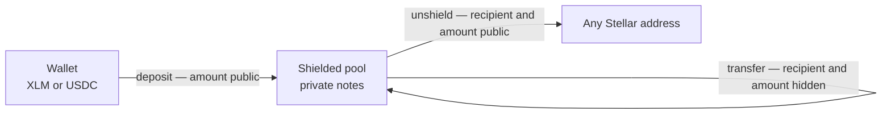

# Hypertron Privacy Protocol

> [!CAUTION]
> **TESTNET RESEARCH SOFTWARE — NOT AUDITED, NO MULTI-PARTY CEREMONY.**
> The deployed keys come from a single-coordinator setup using OS entropy. They
> are not reproducible from this repository, but the coordinator who ran the
> setup could have retained the toxic waste and could forge proofs. Do not use
> this deployment with assets of value. Mainnet requires a public multi-party
> ceremony, an independent security audit, and a fresh deployment.

Shielded payments on Stellar / Soroban: convert transparent XLM or USDC into
**private notes**, move value without revealing sender, receiver, or amount, and
exit back to a normal address when needed. Auditors can verify history with a
**viewing key** (read-only).



## What's in this repo

| Crate | Role |
|---|---|
| `contracts/commitment` | Poseidon Merkle tree of note commitments |
| `contracts/nullifier` | Double-spend registry |
| `contracts/verifier` | On-chain Groth16 verifier (BLS12-381) |
| `contracts/transfer` | Shielded pool: `deposit` / `unshield` / `transfer` |
| `contracts/compliance` | Optional exit allow/deny policy |
| `prover` | Circuits, viewing-key crypto, `hypertron-prove` CLI |
| `prover-wasm` | Browser + Node WASM package (`@hypertron/prover`) |
| `examples/merchant-settlement` | Thin reference consumer of the public API |

Notes separate spending authority from disclosure:

```text
owner_pk = Poseidon(spend_sk, 0)
cm       = Poseidon(Poseidon(owner_pk, k), v)
nf       = Poseidon(spend_sk, k)
```

Encrypted note blobs contain only `(owner_pk, k, v)`. A viewing secret can
decrypt and verify notes but cannot derive the nullifier or authorize a spend.
Three Groth16 circuits enforce deposit binding, unshield conservation
(`v = amount + change`), and private 1-input/2-output balance
(`v_in = v1 + v2`) with 64-bit range checks.

## Privacy model (honest)

| Hidden | Not hidden |
|---|---|
| Receiver and amount in a private transfer | Transaction timing and existence |
| Deposit-to-spend linkage | Deposit address and amount |
| Note contents from parties without a viewing key | Unshield recipient and amount |
| Sender address when submitted by a relayer | Nullifiers, commitments, ciphertext blobs |

The contracts are relayer-compatible, but this repository does not operate a
relayer. Without one, the submitting account is public. See
[Security](docs/SECURITY.md) for the complete threat model.

## Live testnet

Current deployment (native XLM SAC). Source of truth:
[`deployments/testnet.json`](deployments/testnet.json).

| Role | Contract ID |
|---|---|
| **Pool** | `CB2SVTMGQKQVLUHWC5J7K5NOHPXULWEJL452B457NCRW7OKJ42XSVOLL` |
| Commitment | `CD7ZZPCQR7DDZHRNRDUFQ5PKSZK3KVPR3HXKO32NR5QNZWNH2ASVCMTQ` |
| Nullifier | `CCIZPBTVHFO6PCUB7APABIBSIJUUND2WVW6NSA2RBPCEOLUMASKF7KQD` |
| Verifier | `CCHSL7YSPSCT62DBUSCG4CKBJ2I4U4JSBR4RE3YIEGNSEUYXYY7BDIEP` |
| Token (XLM SAC) | `CDLZFC3SYJYDZT7K67VZ75HPJVIEUVNIXF47ZG2FB2RMQQVU2HHGCYSC` |

VK ids: deposit=`1`, unshield=`2`, transfer=`3`, transfer-2=`4`, transfer-4=`5`.

Keys come from a single-coordinator setup and are suitable only for integration
testing. Proving keys live under `vk/*.pk.bin` locally and are gitignored; their
hashes are published in [`deployments/testnet.json`](deployments/testnet.json).

Verify that the deployment matches what is published:

```bash
./scripts/verify_deployment.sh
```

It hashes the local artifacts against the manifest and then confirms the chain
accepts a freshly generated proof from each proving key — a Groth16 pairing
check cannot pass against an unrelated verifying key, so this establishes the
on-chain keys without trusting the manifest or its author.

[Pool on Stellar Lab →](https://lab.stellar.org/r/testnet/contract/CB2SVTMGQKQVLUHWC5J7K5NOHPXULWEJL452B457NCRW7OKJ42XSVOLL)

## Quick start

**Prereqs:** Rust toolchain, `wasm32v1-none` target, [Stellar CLI](https://developers.stellar.org/docs/tools/cli) (for deploy).

```bash
# Build contracts (WASM)
cargo build --release --target wasm32v1-none

# Run tests (contracts + prover; e2e Groth16 tests take ~1–2 min)
cargo test --workspace
cargo test -p hypertron-prover

# Prover CLI
cargo run -p hypertron-prover -- --help
# Setup draws from the OS CSPRNG. Single-coordinator, not a ceremony.
cargo run -p hypertron-prover -- setup --circuit deposit --pk-out deposit.pk.bin --vk-out deposit.vk.json
cargo run -p hypertron-prover -- keygen

# WASM npm package (browser + Node)
cd prover-wasm && ./build.sh
```

### Deploy (testnet)

```bash
stellar keys generate hypertron --network testnet   # skip if identity exists
stellar keys fund hypertron --network testnet

# Native XLM SAC on testnet (or set TOKEN to another SAC)
GENERATE_KEYS=1 TOKEN=CDLZFC3SYJYDZT7K67VZ75HPJVIEUVNIXF47ZG2FB2RMQQVU2HHGCYSC \
  ./scripts/deploy_testnet.sh
```

`GENERATE_KEYS=1` runs a single-coordinator setup from OS entropy for all three
circuits and prints the artifact hashes to record in the deployment manifest.

Then update [`deployments/testnet.json`](deployments/testnet.json) with the printed IDs.

## Flows

1. **Shield (`deposit`)** — pull tokens in; prove the commitment opens to `amount`.
2. **Transfer (`transfer`)** — spend one note → two notes; no public address or amount. Relayer-submittable.
3. **Unshield (`unshield`)** — pay a public recipient; keep change in the pool. Relayer-submittable.

One pool per asset (e.g. separate XLM and USDC pools). Apps can show a unified shielded balance.

## Docs

| Doc | Contents |
|---|---|
| [docs/SECURITY.md](docs/SECURITY.md) | Security status, trust assumptions, and mainnet blockers |
| [docs/PROTOCOL.md](docs/PROTOCOL.md) | Note model, keys, circuits, and public inputs |
| [docs/ARCHITECTURE.md](docs/ARCHITECTURE.md) | Contract composition and data flows |
| [docs/CEREMONY.md](docs/CEREMONY.md) | Development setup and production ceremony requirements |
| [docs/CAPS.md](docs/CAPS.md) | Stellar host functions and protocol features the contracts rely on |
| [prover-wasm/README.md](prover-wasm/README.md) | `@hypertron/prover` JS usage |

## Status

- Protocol contracts + prover: **built and tested** (incl. real-proof e2e lifecycle).
- Testnet pool: **deployed** — see [`deployments/testnet.json`](deployments/testnet.json).
- WASM client prover: **built** (`prover-wasm` → `@hypertron/prover`).
- Indexer and application note scanner live in separate Hypertron repositories.
- A production relayer is not deployed.
- Mainnet is blocked on circuit freeze, a multi-party ceremony, and an external audit.

## License

Apache-2.0
