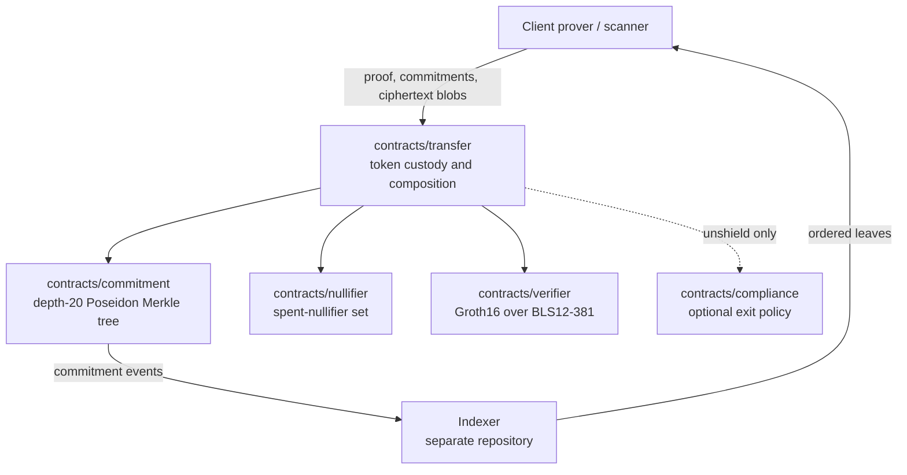
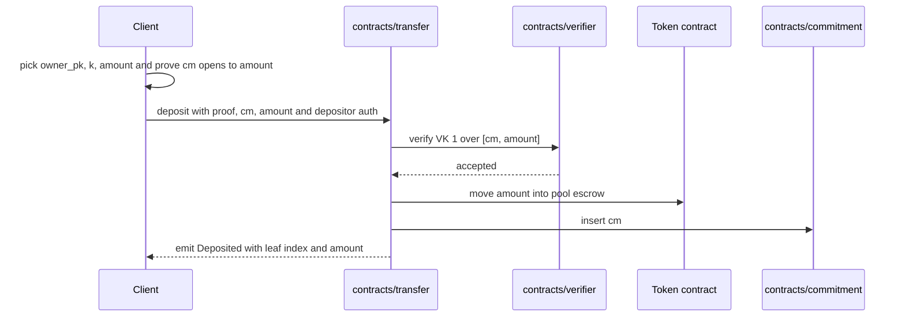
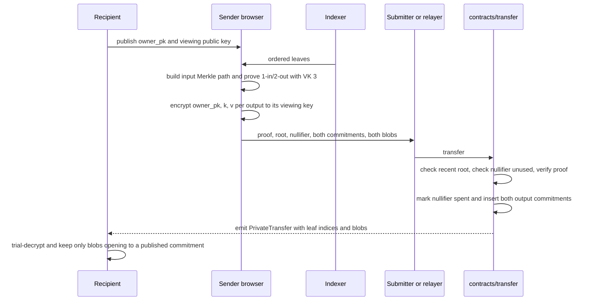
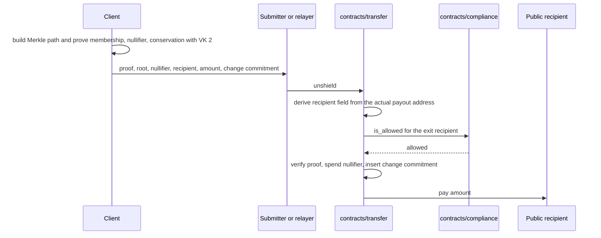

# Architecture

Hypertron separates the shielded pool into small Soroban contracts and keeps
witness generation in a shared native/browser prover. This document describes
the deployed testnet architecture.

## Components

| Component | Responsibility |
|---|---|
| `contracts/commitment` | Depth-20 Poseidon Merkle tree and recent-root history |
| `contracts/nullifier` | Persistent set of spent nullifiers |
| `contracts/verifier` | Admin-registered Groth16 verification keys and CAP-0059 pairing verification |
| `contracts/transfer` | Token custody and atomic deposit, transfer, and unshield composition |
| `contracts/compliance` | Optional allowlist/denylist check at transparent exit |
| `prover` | Circuits, setup/proof CLI, Merkle paths, note math, viewing encryption |
| `prover-wasm` | Browser/Node bindings for the same prover code |
| `examples/merchant-settlement` | Thin reference consumer using the pool's public client ABI |

The separate Hypertron indexer records commitment events and serves the ordered
leaf list required for witness construction. It is not a proof verifier and
cannot authorize a spend.

## Authority model

- The transfer pool is the only authority allowed to insert commitments.
- The transfer pool is the only authority allowed to mark nullifiers spent.
- The verifier admin may register or replace verification keys by ID.
- The optional compliance admin controls its allowlist or denylist.
- A depositor authorizes token transfer into the pool.
- Private transfer and unshield are permissionless to submit; correctness and
  authorization come from the proof.

Verifier-key administration is a security-sensitive deployment role: the admin
can replace registered keys. A production governance and upgrade policy is not
yet defined. Contract initializers are first-call setters and must be completed
immediately after deploy to avoid first-caller takeover.

## Flow: deposit

Deposits are transparent entries: source and amount are public.

## Flow: private transfer

No recipient address or amount is a public proof input. A production relayer is
still required to avoid exposing the sender through transaction submission.
Because blobs are not proof-bound, scanners must treat commitment match as the
source of truth and ignore decryptable blobs that do not open to the published
leaf.

## Flow: unshield

The exit recipient and amount are public. There is no on-chain encrypted change
blob for unshield; wallets must retain change note material themselves.

`PrivacyAttested` records the caller's claim flags after rejecting only
`timing=true`. Do not treat it as proof that receiver or amount were hidden.

## Indexer and data availability

The chain is authoritative for roots and spent nullifiers. The indexer provides
historical ordered leaves because RPC event retention is not a permanent data
availability layer.

Current limitation: the frontend consumes indexer leaves to build proofs but
does not yet independently recompute the full root and compare it with the
on-chain root before proving. Adding that check is the next trust-minimization
milestone. It would let clients reject incomplete or reordered leaf responses.

## Atomicity and state ordering

Soroban contract errors do not automatically make unsafe ordering acceptable.
The pool performs root, nullifier, compliance, and proof validation before
state mutation or token movement. On success it marks nullifiers, inserts new
commitments, and transfers tokens as one invocation.

## Storage lifetime

Contracts extend TTL for instance state, roots, leaves, verification keys, and
nullifiers. Nullifier retention is safety-critical: forgetting a spent
nullifier could permit a double-spend. Production operations must monitor and
extend contract state before archival thresholds.

## Repository boundaries

This repository is the cryptographic and contract core. It does not contain:

- Merchant accounts, payment-link APIs, or dashboard UI.
- The production indexer repository.
- A deployed relayer.
- Fiat anchor integration.
- Accounting exports or invoice-bound disclosure proofs.

Those application services consume this protocol; they are not part of its
trusted cryptographic core.
