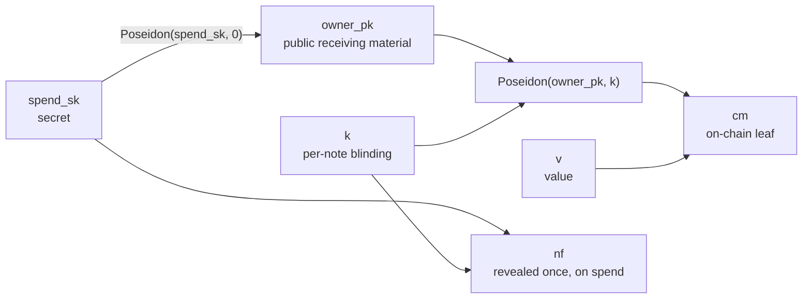
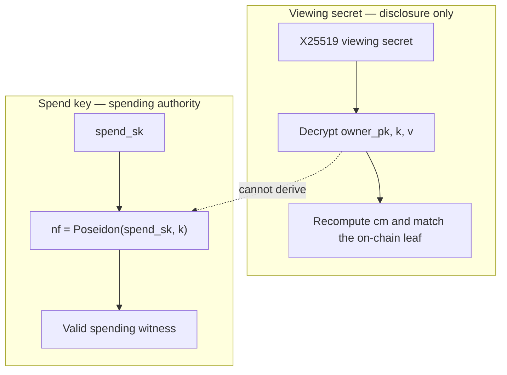

# Protocol

This document is the source of truth for Hypertron's current note construction,
circuits, and contract-visible values. It describes the code in this repository,
not planned multi-input circuits or future compliance features.

## Cryptographic backend

Hypertron uses Groth16 over **BLS12-381** end to end:

- Arkworks `ark-bls12-381` for circuit setup, proving, and local verification.
- `soroban_sdk::crypto::bls12_381` for on-chain Groth16 verification.
- Poseidon over the BLS12-381 scalar field for note commitments, nullifiers,
  owner keys, and Merkle nodes.

This is the CAP-0059 path.

## Notes and keys

A note contains an owner public key, a fresh blinding factor, and a value:

```text
owner_pk = Poseidon(spend_sk, 0)
cm       = Poseidon(Poseidon(owner_pk, k), v)
nf       = Poseidon(spend_sk, k)
```

Where:

- `spend_sk` is the secret required to spend.
- `owner_pk` is public receiving material derived from `spend_sk`.
- `k` is a per-note random blinding factor.
- `v` is the note value. Deposit amounts and output values are explicitly
  64-bit range-checked; a spent input value is constrained by the conservation
  equation with those outputs.
- `cm` is the on-chain commitment leaf.
- `nf` is revealed once when the note is spent.



The commitment hides the note contents. The nullifier prevents double-spending
without identifying the commitment being spent.

## Spend and view separation

The viewing key is an independent X25519 keypair. For each output note, the
sender encrypts this plaintext:

```text
owner_pk || k || v
```

Encryption uses an ephemeral X25519 key, a SHA-256 domain-separated KDF, and
ChaCha20-Poly1305. The emitted blob is:

```text
ephemeral_public_key || ciphertext
```



`spend_sk` is never encrypted. A viewing-secret holder can decrypt amounts and
recompute commitments, but cannot compute `Poseidon(spend_sk, k)` or construct a
valid spending witness.

Blob length for a valid AEAD ciphertext is 144 bytes: 32-byte ephemeral public
key, 96-byte plaintext, and 16-byte Poly1305 tag. The ChaCha nonce is implicit
all-zeros; uniqueness comes from a fresh ephemeral key per note.

## Commitment tree

The commitment contract maintains a depth-20 incremental Poseidon Merkle tree:

- Capacity: `2^20` leaves.
- Only the configured pool authority may insert.
- Duplicate leaves are rejected.
- The most recent 32 roots are retained for in-flight proofs.
- Commitment insertions emit index, leaf, and root.

The indexer preserves the ordered leaf sequence beyond RPC event retention so a
client can reconstruct its authentication path.

## Circuits

Each circuit has a separate proving key and on-chain verification-key ID.

### Deposit

Purpose: bind a transparent token deposit to the value of a new note.

```text
Public:  [cm, amount]
Private: [owner_pk, k]
Checks:
  cm = Poseidon(Poseidon(owner_pk, k), amount)
  amount is 64-bit
```

No spend key is required to fund a known `owner_pk`.

### Transfer (current: 1 input / 2 outputs)

Purpose: spend one note and create a recipient note plus a second output,
normally change, without exposing addresses or values.

```text
Public:  [root, nf, out_cm1, out_cm2]
Private: [spend_sk, input k, input v, Merkle path,
          owner_pk1, k1, v1, owner_pk2, k2, v2]
Checks:
  owner_pk = Poseidon(spend_sk, 0)
  input commitment is in root
  nf = Poseidon(spend_sk, input k)
  out_cm1 and out_cm2 open correctly
  v1 and v2 are 64-bit
  input v = v1 + v2
```

The contract checks that `root` is recent and `nf` is unused, verifies the
proof, marks the nullifier spent, inserts both commitments, and emits both
opaque note blobs. Those blobs are **not** bound by the circuit: they can be
altered by the submitter without invalidating the proof. Recipients must verify
that a decrypted note opens to the published commitment.

### Unshield

Purpose: spend a note to a public Stellar recipient and keep any remainder as a
new note owned by the same spend key.

```text
Public:  [root, nf, recipient_field, amount, change_cm]
Private: [spend_sk, input k, input v, Merkle path, change k, change v]
Checks:
  input commitment is in root
  nf = Poseidon(spend_sk, input k)
  change note uses Poseidon(spend_sk, 0)
  amount and change v are 64-bit
  input v = amount + change v
```

`recipient_field` is the BLS12-381 scalar reduction of
`SHA-256(XDR(ScVal::Address(recipient)))`. The contract derives it from the
actual payout address, so a submitter cannot redirect the unshield. Unshield
does not emit an encrypted change blob; the wallet must retain change material.

## Verification-key IDs

The current testnet pool is configured with:

| Circuit | VK ID |
|---|---:|
| Deposit | 1 |
| Unshield | 2 |
| Transfer 1-in/2-out | 3 |

IDs are deployment configuration, not permanent protocol constants. Any circuit
change requires a new setup and a distinct, documented key registration.

## Authorization and relaying

Deposit calls `require_auth` on the transparent source account because tokens
move into the pool. Transfer and unshield do not require a note-owner signature:
the proof binds the allowed state transition, making both calls compatible with
a relayer. A relayer cannot alter output commitments, payout destination,
amount, or change without invalidating the proof. A relayer **can** alter
transfer ciphertext blobs because they are not proof inputs.

## Public events

- `Deposited`: leaf index and public amount.
- `PrivateTransfer`: nullifier, two output indices, two encrypted note blobs.
- `Unshielded`: nullifier, public amount, change index.
- `PrivacyAttested`: an unshield metadata record. It always sets
  `sender=true`, `linkability=true`, and `timing=false`. Caller-selected
  `receiver` / `amount` flags are not independently proven, and unshield
  recipient/amount remain public regardless.

See [SECURITY.md](SECURITY.md) for what these events expose.
