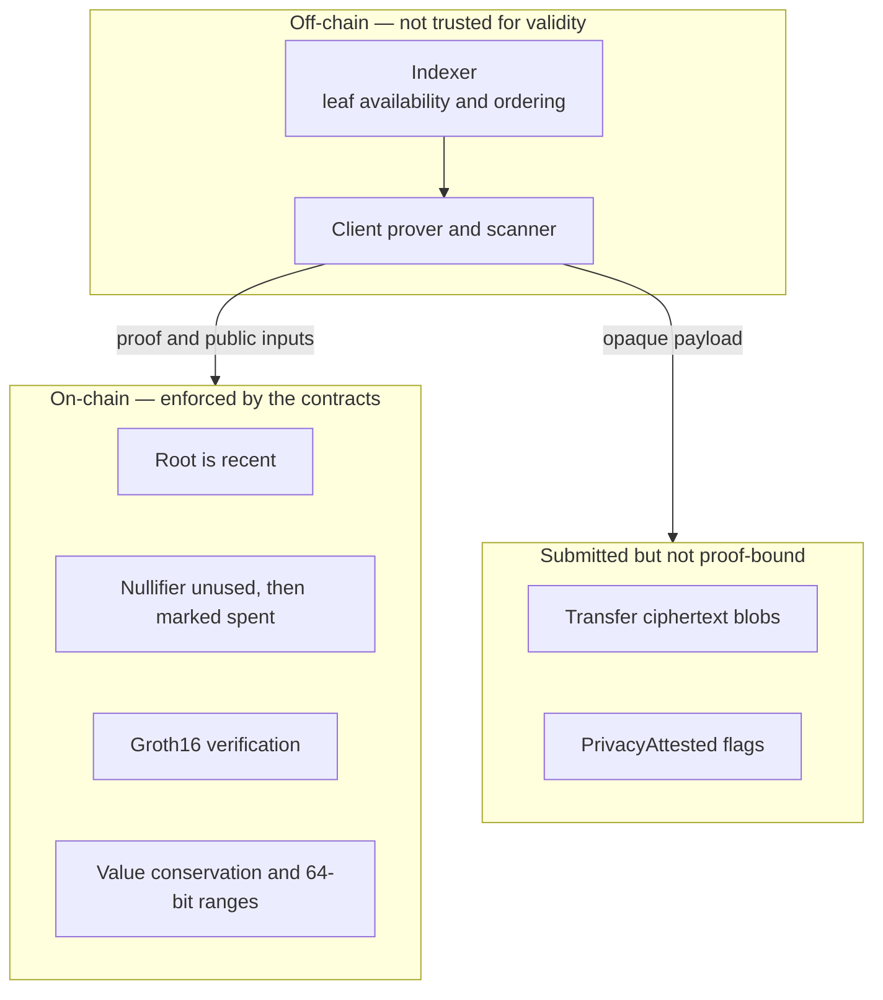

# Security

## Current status

> [!CAUTION]
> Hypertron is testnet research software. The deployed Groth16 keys come from a
> **single-coordinator setup**: the coordinator who ran it could have retained
> the toxic waste and could forge proofs. No multi-party ceremony and no
> independent audit have been completed. Do not use the current contracts with
> assets of value.

The setup randomness is drawn from the OS CSPRNG and no seed material is written
to disk, so the keys are not reproducible from this repository. That is the only
claim being made. It rules out forgery by an arbitrary reader; it does not rule
out forgery by the coordinator, which is exactly what a multi-party ceremony
exists to eliminate.

Keys generated before 2026-08-15 came from the public seed `1`. Their toxic
waste was recoverable by anyone, so proofs under them were forgeable by anyone.
Those keys are retired and are no longer registered on-chain.

A passing proof on the current testnet deployment demonstrates integration, not
production security.

Anyone can check that the deployed keys are the published ones:

```bash
./scripts/verify_deployment.sh
```

That hashes the local artifacts against
[`deployments/testnet.json`](../deployments/testnet.json) and confirms the chain
accepts a freshly generated proof from each proving key.

## Mainnet blockers

All of the following are required before a production deployment:

1. Freeze circuit definitions and public-input order.
2. Run a documented multi-party Groth16 ceremony for every circuit.
3. Destroy or make unrecoverable each participant's contribution secrets.
4. Publish ceremony transcripts, artifact hashes, and resulting verification keys.
5. Register only ceremony-produced keys in a fresh verifier deployment.
6. Complete an independent audit covering circuits, contracts, prover, key
   derivation, note encryption, deployment, and operational controls.
7. Benchmark proof generation and on-chain verification against production limits.

See [CEREMONY.md](CEREMONY.md).

## Trust boundaries



### Enforced on-chain

- Deposits cannot create a note whose value exceeds the transferred amount.
- A spend must prove membership in a known Merkle root.
- A spend must reveal the correct nullifier for the spend key and note blinding.
- A nullifier can be accepted only once.
- Transfers conserve value across one input and two outputs.
- Unshields bind the proof to the root, nullifier, recipient, amount, and change
  commitment.
- Groth16 verification runs in the Soroban contract through BLS12-381 host
  functions.

### Not enforced by the proof

- Transfer ciphertext blobs (`note_1`, `note_2`) are **not** circuit public
  inputs. A submitter can replace, empty, or omit them without invalidating the
  proof. Ownership and value still follow the proof-bound commitments; what is
  at risk is recipient discovery and recovery.
- Unshield does not emit an encrypted change-note blob. Change recovery depends
  on the wallet retaining or reconstructing that note.
- `PrivacyAttested` is not cryptographic proof that every claimed dimension is
  hidden. Unshield always exposes recipient and amount. The contract only
  rejects `timing=true`; caller-selected `receiver` / `amount` flags are not
  independently validated as privacy properties.
- The verifier admin can replace a registered verification key at any time, with
  no timelock, and the `VkRegistered` event carries only the `vk_id` rather than
  the key or its hash. An observer therefore cannot detect a key swap from
  events alone; they must re-run `scripts/verify_deployment.sh`. Production
  needs an explicit upgrade policy for that role, and registration should become
  append-only or timelocked.
- Contract `initialize` methods are first-call setters. Deployments must
  initialize promptly to avoid first-caller takeover.

### Off-chain but not trusted for validity

Witness construction and proof generation run in the client. A malicious prover
cannot make an invalid statement pass a sound verifier. Soundness of the current
deployment rests entirely on the setup coordinator not having retained the toxic
waste, which is an assumption about a person rather than a property of the
system.

Proof randomness (the Groth16 `r, s` blinders) comes from the OS CSPRNG on every
proving path. This is what makes proofs of the same statement distinct; with
reproducible blinders a proof is a deterministic function of its witness, so
proofs become linkable and a guessed witness can be confirmed by recomputation.

The indexer supplies ordered commitment leaves needed to construct Merkle paths.
The chain remains the authority for accepted roots and nullifiers. Client-side
recomputation of the root from indexer leaves is planned; until it ships,
clients depend on the indexer for availability and correct path construction.

### Secret material

- `spend_sk` authorizes spending and must never be exported to an auditor.
- The viewing secret decrypts note blobs. It reveals `owner_pk`, `k`, and `v`
  but not `spend_sk`, so it cannot derive the valid nullifier or spend a note.
- Proving keys are public artifacts after a safe ceremony. Ceremony contribution
  secrets are the toxic waste that must be destroyed.

## Privacy properties and limitations

| Flow | Hidden | Public |
|---|---|---|
| Deposit | Future link from this note to a spend | Depositor, asset, amount, commitment, timing |
| Private transfer | Recipient address, transferred amount, input/output linkage | Root, nullifier, two commitments, ciphertext blobs, timing, submitter |
| Unshield | Link to the original deposit; sender if relayed | Recipient, amount, root, nullifier, change commitment, timing |

Additional limitations:

- The contracts permit relayed transfers and unshields, but this repository does
  not operate a production relayer. Direct submission exposes the submitter.
- There is no batching or delay mechanism, so timing correlation remains possible.
- Ciphertext blobs reveal their size and event location, though not plaintext.
- Because transfer blobs are not proof-bound, a malicious or buggy submitter can
  break scanning without stealing the commitments themselves.
- A viewing key is read-only but highly sensitive: it discloses amounts and note
  ownership metadata for notes encrypted to it.
- Compliance policy is optional and applies only to the transparent unshield
  recipient. It does not screen private-transfer recipients.
- The current transfer circuit is one input and two outputs. Notes cannot yet be
  consolidated in one proof.
- Persistent roots, leaves, nullifiers, and VKs require ongoing TTL extension.
  Losing a spent nullifier would enable a double-spend.

## Cryptographic choices

- Proof system: Groth16
- Pairing curve and scalar field: BLS12-381
- On-chain verifier: Soroban CAP-0059 host functions
- Note/Merkle hashing: Poseidon over the BLS12-381 scalar field
- Viewing encryption: X25519 ECDH + SHA-256 KDF + ChaCha20-Poly1305
- Merkle depth: 20; accepted root history: 32 roots
- Explicit 64-bit range checks on deposit amount, transfer outputs, unshield
  amount, and unshield change; spent input value is constrained by the balance
  equation rather than a separate bit decomposition

## Reporting

Do not post suspected vulnerabilities publicly before maintainers have had a
reasonable opportunity to investigate. Until a dedicated disclosure address is
published, open a minimal GitHub issue requesting a private security contact
without including exploit details.
